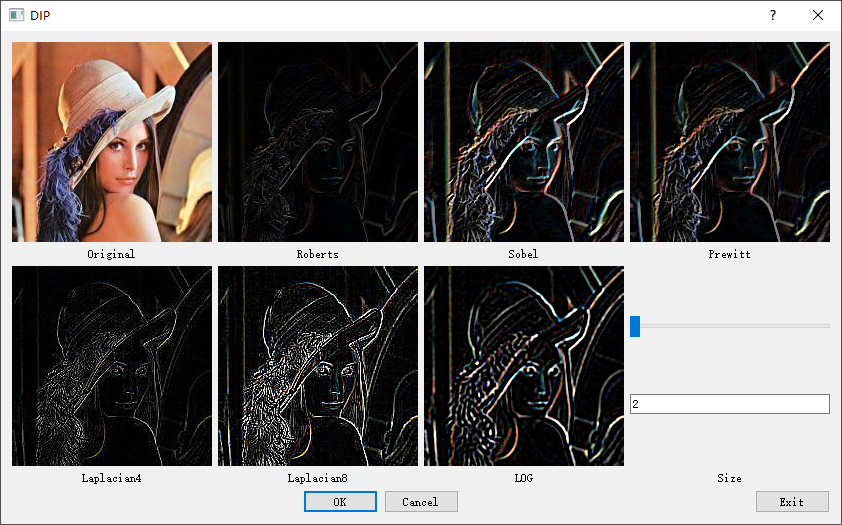
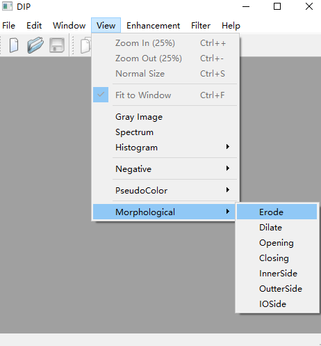
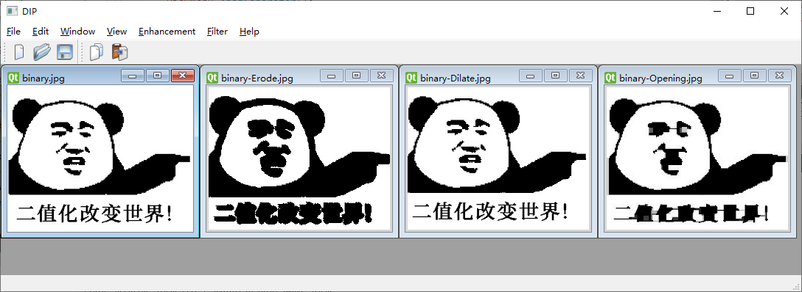

# dip —— Software for **Digital Image Processing** using Qt

## 1. Environment Configuration
windows 10 + Qt 5.14.2 + MSVC 2017 + fftw 64bit

## 2. Function Lists

### 1) MDI mode
### 2) View menu: grayscale, spectrum, histogram, negative, pseudo color
### 3) Enhancement menu: Histogram equalization, Adaptive contrast enhancement
### 4) Filter menu: Space domain, Frequency domain, Emboss filter
### 5) Multiple language dynamic switching

****
### 作业完成情况：
- 主要是阅读了图像处理部分的相关源码，对一些内容进行了注释，主要集中在[imagepocess.cpp](./imagepocess.cpp)，[transform.cpp](./transform.cpp)，[padding.cpp](./padding.cpp)以及[sdfilterdialog.cpp](./sdfilterdialog.cpp)几个源文件。（不是很详细，还需要继续花时间阅读、理解）
- MDI部分阅读了主要的代码实现，改动了几个地方：
  - 针对filter->Space Domain，filter->Emboss Filter两个对话窗口弹出来的页面太大，超出屏幕显示的问题，改动了相应的layout，使其正常显示。
  
  
  - 添加了形态学运算的操作显示接口，实现多语言支持（中英）
  
  

- 腐蚀、膨胀、开运算、闭运算等多种形态学运算的具体功能实现。

  
